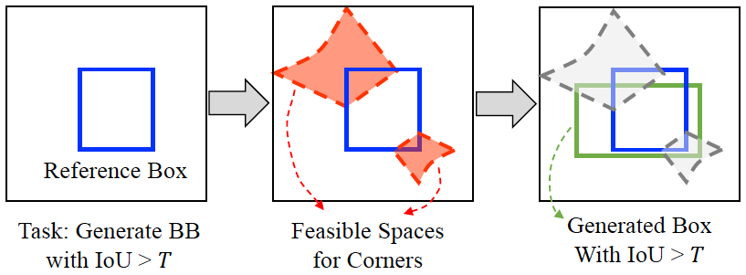
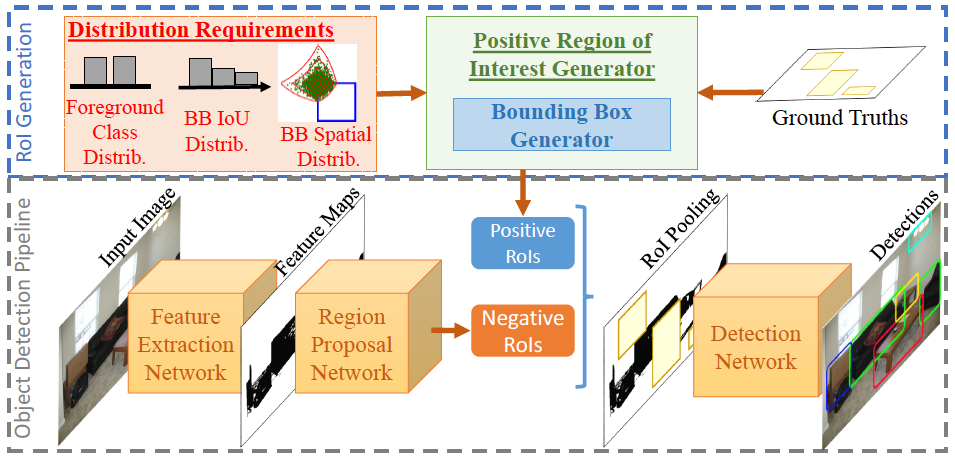

# Generating Positive Bounding Boxes for Balanced Training of Object Detectors

This repository contains Pytorch implementations of the Bounding Box Generator, positive RoI Generator and Online Foreground Balanced sampling (arxiv link). The repository is based on object detection framework. You may refer to mmdetection for a thorough understanding of the framework in the followinf link:

Please cite the following paper if you use this repository. 

Kemal Oksuz, Baris Can Cam, Emre Akbas, Sinan Kalkan, "Generating Positive Bounding Boxes for Balanced Training of Object Detectors," In: IEEE Winter Conference on Applications of Computer Vision (WACV) (2020). 

Here, we present the implementations of 3 modules in this repository:

## Bounding Box Generator

IDEA: Given a bounding box  (or any arbitrary rectangle) and a desired minimum IoU threshold (), bounding box generator outputs a bounding box  with T" />. The following figure illustrates the idea. 



CODE: In the following line you can see an implementation of the extended version of the bounding box generator which outputs one box for each IoU in the given list of IoUs.

https://github.com/kemaloksuz/mmdetection/blob/8556e3c9c3f1656d08668a43f4142033cc6612f1/mmdet/core/bbox/samplers/bounding_box_generator.py#L180


## Positive RoI Generator

IDEA: We devised positive RoI (pROI) Generator as a specific application of the Bounding Box Sampler. Given the desired IoU and spatial distributions of the RoIs, pRoI generator is able to generate a set of foreground-balanced bounding boxes by sticking to the specified input distributions. In order to generate bounding boxes pRoI Generator uses Bounding Box Generator as a subroutione. Following figure illustrates our pipeline during training.



CODE: Following link is the address of the code of our pRoI generator. 

https://github.com/kemaloksuz/mmdetection/blob/BB-Generation-and-OFB-Sampling/mmdet/core/bbox/samplers/pRoI_generator.py 

One can employ it easily by sticking to the sampler conventions in the mmdetection framework. You can find configuration file examples in the configs/BBGeneration folder. 

Experimentally we have showed that our pRoI sampler is able to provide more samples for larger IoUs compared to RPN RoIs.

## Online Foreground Balanced Sampling

IDEA: Different from the generators, Online Foreground Sampling is a sampler such as Random Sampler, OHEM Sampler etc. One difference from them is that we only consider positive examples in the batch, so it can also be combined to negative samplers. Main motivation is to generate a batch as balanced as possible from the classes within the batch. That's why we assign probabilities to each positive candidate RoI by considering the total number of each class. Basically, we utilize multinomial sampling.

CODE: Following links are the addresses of the code of our plain OFB sampler and OFB sampler combined with Online Hard Negative Mining respectively. 

https://github.com/kemaloksuz/mmdetection/blob/BB-Generation-and-OFB-Sampling/mmdet/core/bbox/samplers/foreground_balanced_pos_sampler.py

https://github.com/kemaloksuz/mmdetection/blob/BB-Generation-and-OFB-Sampling/mmdet/core/bbox/samplers/OFB_with_OHNM.py

You can find configuration file examples in the configs/OFB folder. 

## Citation

If you use any of these properties in your research, please cite our paper.

```
@inProceedings{BBGenerator,
  title   = {Generating Positive Bounding Boxes for Balanced Training of Object Detectors,
  author  = {Oksuz, Kemal and Cam, Baris Can and Akbas, Emre and Kalkan, Sinan},
  booktitle={IEEE Winter Conference on Applications of Computer Vision (WACV)},
  year      = {2020}
}
```


## Contact
Please contact Kemal Öksüz (kemal.oksuz@metu.edu.tr) for your questions about this webpage.